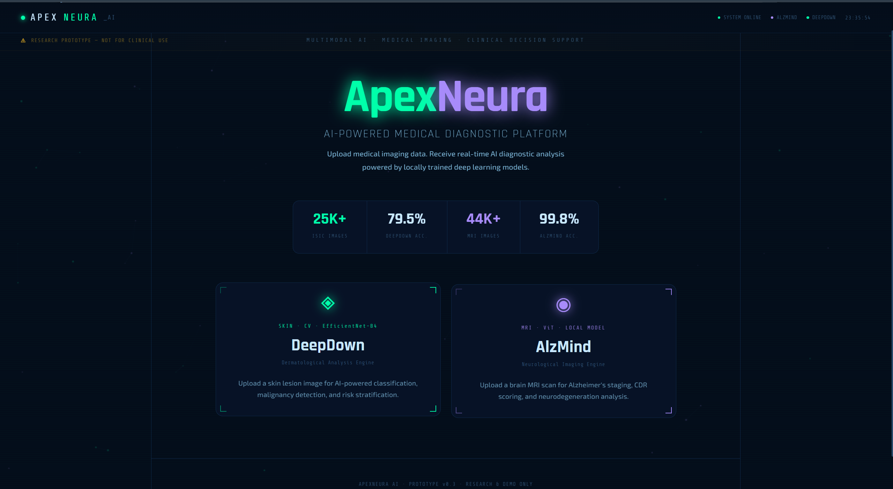
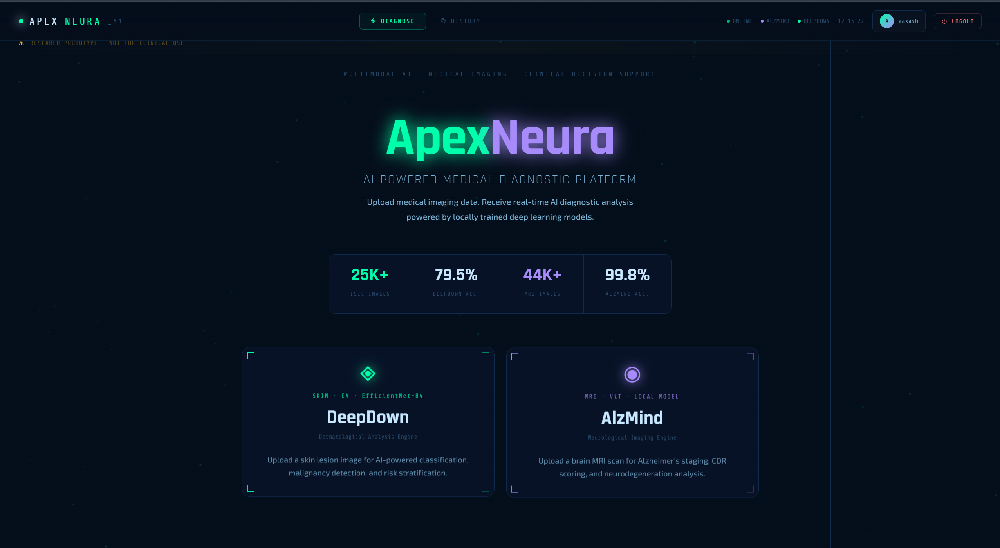
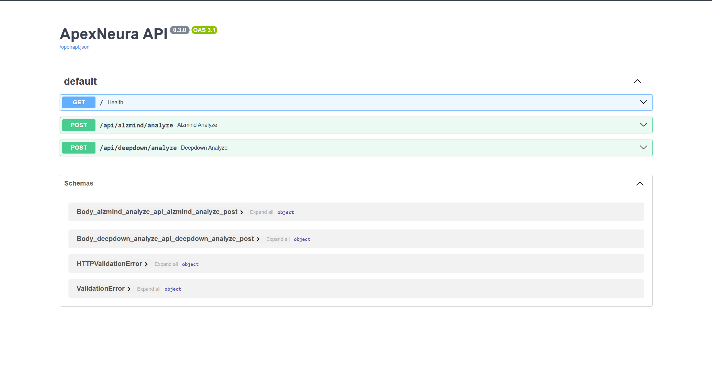

# ApexNeura AI

<p align="center">
  
</p>

<p align="center">
  <b>AI-Powered Medical Diagnostic Platform</b><br/>
  Skin Lesion Analysis · Alzheimer's MRI Detection · AI Medical Assistant
</p>

<p align="center">
  <a href="https://apex-neura.vercel.app" target="_blank"><b>🔗 Live Demo</b></a> &nbsp;|&nbsp;
  <a href="https://github.com/Aakash-vajpayee/ApexNeura-" target="_blank"><b>📂 GitHub</b></a>
</p>

<p align="center">
  
  
  
  
  
</p>

---

## Overview

ApexNeura is a full-stack AI medical diagnostic platform with two locally-trained deep learning models and an AI-powered medical chatbot. The system gathers patient history through conversation before performing image analysis.

**Demo Flow:**
```
Module Select → NeuraBot (3 questions) → Image Upload → AI Analysis → PDF Report
```

---

## Modules

### ◈ DeepDown — Dermatological Analysis
- Skin lesion classification (Benign / Malignant / Indeterminate)
- EfficientNet-B4 trained on 25K+ ISIC dataset images
- **79.5% accuracy** · Risk stratification · ICD-10 mapping
- Class probability breakdown with confidence scores

### ◉ AlzMind — Neurological Imaging
- Alzheimer's staging from brain MRI scans
- Vision Transformer (ViT) trained on 44K+ MRI images
- **99.8% accuracy** · CDR scoring · Affected brain regions
- 4-class classification: NonDemented → VeryMild → Mild → Moderate

### 🧠 NeuraBot — AI Medical Assistant
- Gemini-powered conversational AI
- Asks exactly 3 targeted questions before image analysis
- Responds in Hindi / English / Hinglish
- Session-based conversation history

---

## Screenshots

### 🏠 Dashboard

<!--  -->


### 📡 API Documentation


---

## Tech Stack

| Layer | Technology |
|-------|-----------|
| Frontend | React 19 + Vite |
| Backend | FastAPI + Python |
| Skin Model | EfficientNet-B4 (timm) |
| Brain Model | Vision Transformer (ViT) |
| AI Chatbot | Google Gemini + LangChain |
| Database | MongoDB Atlas |
| Auth | JWT + bcrypt |
| PDF Reports | ReportLab |
| Deployment | Vercel + ngrok |

---

## Features

- 🔐 JWT Authentication (Register / Login)
- 🤖 AI chatbot gathers patient info before analysis
- 🧬 Local ML inference (no external API for models)
- 📊 Detailed diagnostic reports with confidence scores
- 📄 Professional PDF report generation
- 📁 Report history with filter by module/risk level
- 🗑️ Delete reports from history
- ⬇️ JSON export of results

---

## Project Structure

```
ApexNeura/
├── frontend/
│   ├── src/
│   │   ├── ApexNeuraApp.jsx    # Main app + ChatPanel
│   │   ├── AuthPage.jsx        # Login / Register
│   │   └── App.jsx             # Root component
│   ├── package.json
│   └── vite.config.js
│
├── backend/
│   ├── main.py                 # FastAPI endpoints
│   ├── chat.py                 # NeuraBot (Gemini)
│   ├── auth.py                 # JWT authentication
│   ├── database.py             # MongoDB connection
│   ├── models.py               # Pydantic schemas
│   ├── pdf_generator.py        # PDF report generation
│   ├── requirements.txt
│   └── .env                    # API keys (not committed)
│
└── README.md
```

---

## Local Setup

### Clone Repository
```bash
git clone https://github.com/Aakash-vajpayee/ApexNeura-.git
cd ApexNeura-
```

### Backend Setup
```bash
cd backend
python -m venv venv
venv\Scripts\activate          # Windows
pip install -r requirements.txt
```

Create `.env` in backend folder:
```env
GEMINI_API_KEY=your_gemini_api_key
MONGODB_URL=your_mongodb_url
JWT_SECRET=your_secret_key
JWT_ALGORITHM=HS256
JWT_EXPIRE_MINUTES=10080
```

Run backend:
```bash
uvicorn main:app --reload --port 8000
```

### Frontend Setup
```bash
cd frontend
npm install
npm run dev
```

---

## API Endpoints

| Endpoint | Method | Description |
|----------|--------|-------------|
| `/api/auth/register` | POST | User registration |
| `/api/auth/login` | POST | User login |
| `/api/chat` | POST | NeuraBot conversation |
| `/api/deepdown/analyze` | POST | Skin lesion analysis |
| `/api/alzmind/analyze` | POST | Brain MRI analysis |
| `/api/reports/save` | POST | Save report to DB |
| `/api/reports/history` | GET | Get report history |
| `/api/reports/pdf` | POST | Generate PDF report |

---

## Models

| Model | Architecture | Dataset | Accuracy |
|-------|-------------|---------|----------|
| DeepDown | EfficientNet-B4 | ISIC 25K+ images | 79.5% |
| AlzMind | Vision Transformer (ViT) | 44K+ MRI scans | 99.8% |

Both models run **locally** — no external API calls for inference.

---

## Disclaimer

⚠️ This is a **research prototype** for educational purposes only.
Not intended for clinical diagnosis or real medical decision-making.
Always consult certified healthcare professionals.

---

## Author

**Aakash Vajpayee** — AI & Full Stack Developer

---

## License

MIT License

---

# Support

If you found this project helpful, consider giving it a ⭐ on GitHub.
